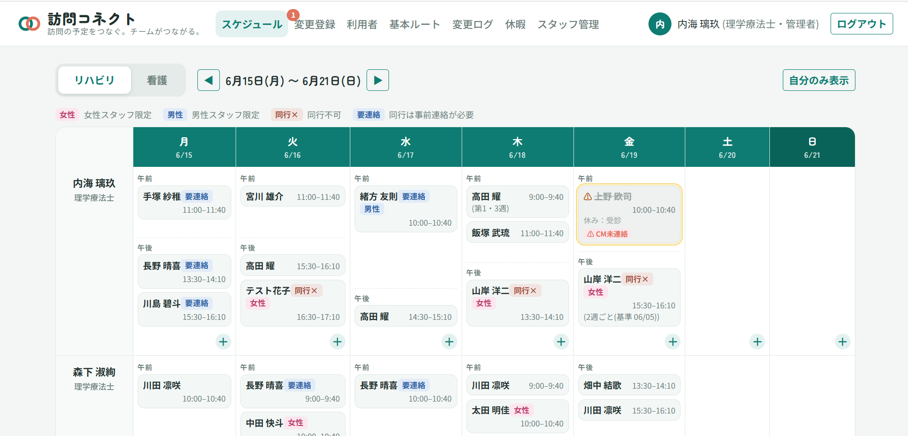
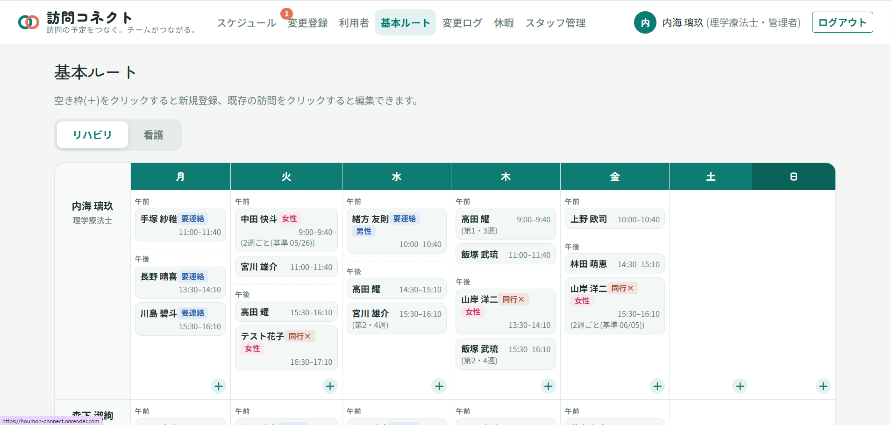
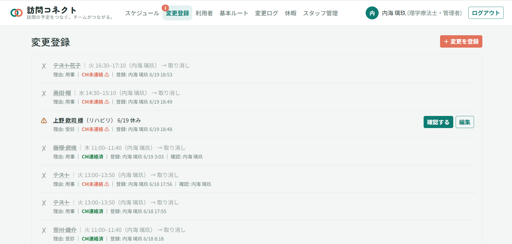
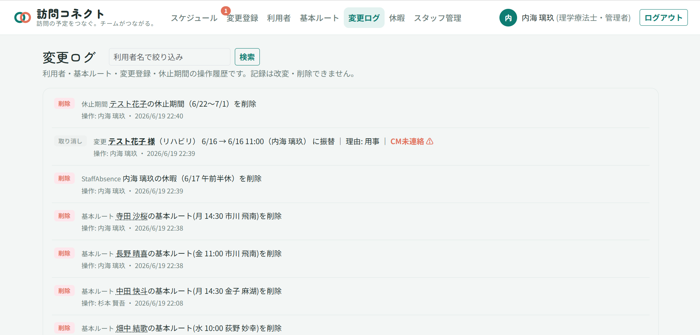
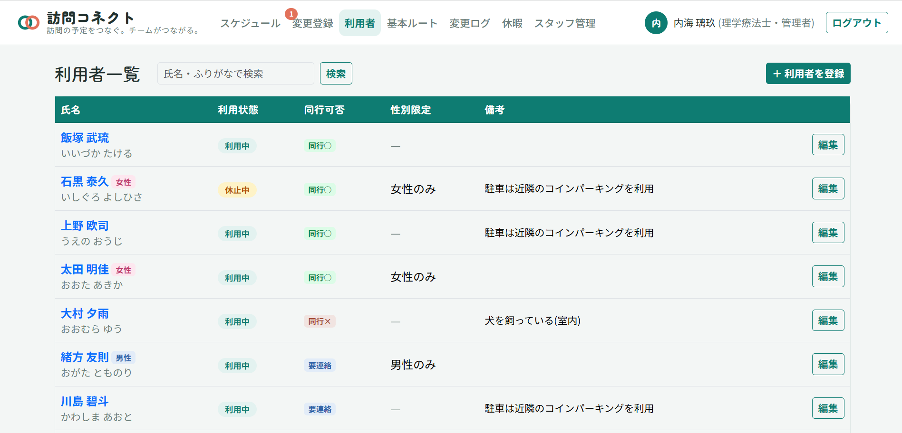
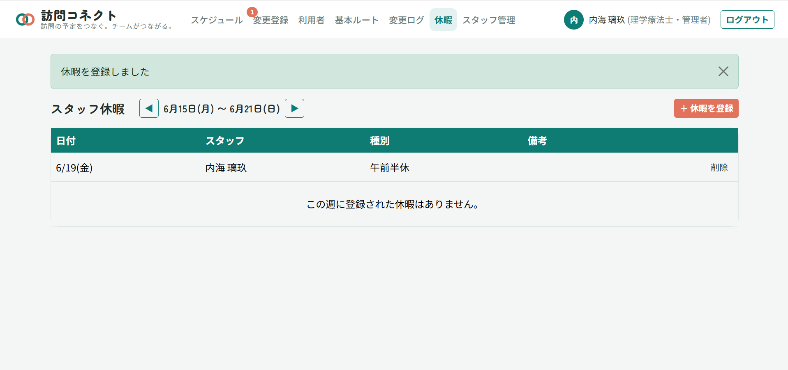

# 訪問コネクト

**訪問の予定をつなぐ。チームがつながる。**

訪問看護・訪問リハビリのスケジュール管理に特化したWebアプリケーションです。現役の理学療法士が、訪問リハビリの現場で感じていたスケジュール管理の課題を解決するために開発しました。

## 🔗 リンク

- **本番環境**: https://houmon-connect.onrender.com
- **説明動画**: https://youtu.be/at8xaMzG7WQ?si=ZI3cCCDl2sLSs3dL

### 試し方（ゲストログイン）

ログイン画面の以下のボタンから、メールアドレスの入力なしですぐにお試しいただけます。

- **「管理者としてゲストログイン」** — スケジュール管理者の視点。スタッフ管理・変更の確認チェックなど、管理者向け機能を体験できます
- **「一般スタッフとしてゲストログイン」** — 訪問スタッフの視点。権限が制限された状態を体験できます

※ 無料プランで運用しているため、初回アクセス時は起動に30〜50秒かかる場合があります。

### デモ用アカウント（個別ログイン）

ゲストログインのほか、以下のアカウントで個別にログインもできます。すべてパスワードは `password` です。

**管理者**
| 職種 | メールアドレス |
|------|----------------|
| 看護師 | nurse-manager@example.com |
| 理学療法士 | rehab-manager@example.com |

**一般ユーザー**
| 職種 | メールアドレス |
|------|----------------|
| 看護師 | ns1@example.com / ns2@example.com |
| 理学療法士 | pt1@example.com / pt2@example.com |

## 📋 アプリ概要

ひとつのステーションに複数のスタッフが在籍し、それぞれが複数の利用者を担当する訪問看護・訪問リハビリの現場では、週に数十〜百件以上の訪問予定の変更をチームで管理する必要があります。

このアプリは、予定変更の多重転記・最新情報の共有遅延・休暇情報の未共有・ケアマネへの連絡漏れといった現場の課題を解決し、特にスケジュールを統括する管理者の負担軽減を目指しています。

## ✨ 主な機能

- **週間スケジュール表示** — スタッフ×曜日のグリッド表示。看護/リハビリのタブ切り替え
- **基本ルート管理** — 定期訪問の雛型を管理。スタッフ重複の禁止・利用者重複の警告
- **変更登録と即時反映** — 承認を待たず即反映。休み/振替を色分け表示
- **Chatwork自動通知** — 変更登録時にグループチャットへ自動通知（外部API連携）
- **変更ログ** — 誰がいつ何を変更したかを記録。改変・削除不可の監査ログ
- **ケアマネ連絡状況の表示** — 連絡漏れを防ぐバッジ表示
- **スタッフ休暇管理** — 全日/半休/時間休に対応。休暇と重なる訪問に「要調整」バッジ
- **利用者の休止期間管理** — 入院等の休止を期間で管理。期間後は自動復活

## 📸 スクリーンショット

**週間スケジュール** — スタッフ×曜日のグリッドで訪問・休暇・振替を一覧表示

**基本ルート一覧** — 定期訪問の雛型を管理。スタッフ・利用者・曜日・時間帯を登録

**変更登録** — 休みや振替をその場で登録。承認不要で即スケジュールに反映

**変更ログ** — 誰がいつ何を変更したかを記録。監査目的で改変・削除不可

**利用者一覧** — 同行可否・性別制限・休止期間などの属性を管理

**スタッフ休暇** — 全日・半休・時間休を登録。スケジュールに休暇バナーを表示

## 🛠 技術スタック

| 分類 | 技術 |
|------|------|
| バックエンド | Ruby on Rails 7.1 |
| データベース | PostgreSQL |
| フロントエンド | Bootstrap 5 / Hotwire (Turbo, Stimulus) |
| 外部API | Chatwork API |
| インフラ | Render |
| テスト | RSpec |

## 💡 設計上のこだわり

変更管理の方式として「申請→承認→反映」も検討しましたが、承認のたびに管理者の対応が必要になり負担が増えるため、**「即時反映 ＋ 改変不可の変更ログ ＋ 管理者の軽量な確認チェック」** という方式を採用しました。スタッフの自律的な運用と、管理者による把握漏れの防止を両立しています。

## 🚀 今後の展望

- 新規利用者の受け入れ調整機能（空き枠の自動提案）
- 会議・カンファレンス等、訪問以外の単発予定の追加機能
- 看護師モニタリング予定（3ヶ月毎）の自動調整機能
- スケジュールのPDF出力機能
