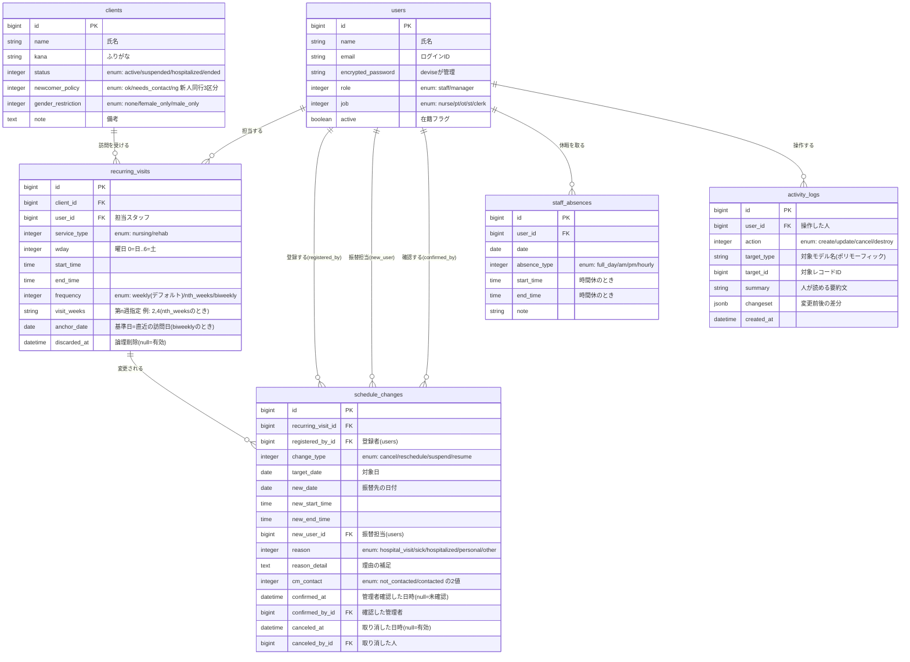
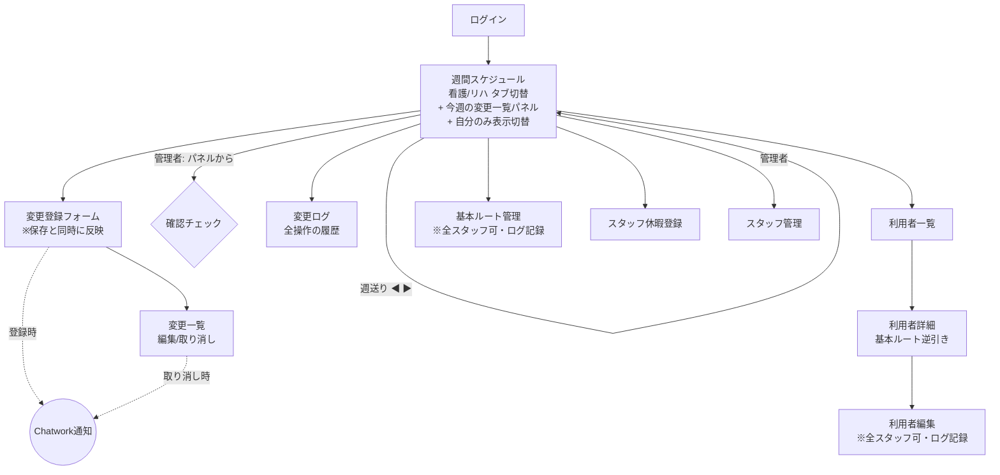

# 設計書 — 訪問コネクト

- 作成日: 2026-06-12(v1.3 更新)
- 対応する仕様書: 仕様書 v1.3
- 完成期限: **2026/6/16(火)アプリ完成 → 6/18(木)説明動画込みで提出**

---

## 1. 技術スタック

| 区分 | 採用技術 | 補足 |
|------|---------|------|
| 言語 | Ruby 3.3.0(rbenv管理・導入済み) | |
| フレームワーク | Ruby on Rails 7.1.6(導入済み) | |
| データベース | PostgreSQL | 本番(Render)と開発で同じDBを使うため |
| フロント | Rails標準のERB + Hotwire(Turbo) | SPAにせず、Railsの王道構成で |
| CSS | **Bootstrap 5(CDN読み込み方式)** | ビルドツール不要で環境トラブルを回避 |
| 認証 | devise(gem) | |
| 外部API | Chatwork API v2(フリープランで利用可) | HTTPクライアントは `faraday` gem |
| テスト | RSpec + FactoryBot | |
| デプロイ | Render | 無料枠で運用可能 |
| バージョン管理 | Git / GitHub | |

---

## 2. データベース設計

### 2.1 ER図

> ER図とは「テーブル同士の関係(リレーション)」を表した図です。
> `||--o{` は「1対多」: 例えば 1人の利用者(Client)は複数の基本ルート(RecurringVisit)を持ちます。



### 2.2 設計のポイント(初心者向け解説)

**(1) 「全員が編集できる」を支える3つの仕掛け**

| 仕掛け | 実現方法 |
|--------|---------|
| 即時反映 | schedule_changes は保存された瞬間からスケジュール合成(3章)の対象になる |
| 消えないログ | activity_logs に全操作を自動記録。更新・削除のルートを作らない |
| 確認チェック | `confirmed_at` が null かどうかで未確認/確認済みを表現する |

`confirmed_at`(日時カラム)を使うのがポイントです。boolean(true/false)ではなく日時にすることで、
「確認したかどうか」と「いつ・誰が確認したか」を1〜2カラムで同時に表現できます。
`canceled_at` や recurring_visits の `discarded_at` も同じ考え方で、
**削除や取り消しを物理削除(destroy)ではなく日時の記録で表現**します。
これを「論理削除」と呼び、履歴を消さないシステムの定石です。

```ruby
# app/models/schedule_change.rb
class ScheduleChange < ApplicationRecord
  enum :change_type, { cancel: 0, reschedule: 1, suspend: 2, resume: 3 }
  enum :cm_contact,  { not_contacted: 0, contacted: 1 }

  scope :effective,   -> { where(canceled_at: nil) }   # 有効な変更だけ
  scope :unconfirmed, -> { effective.where(confirmed_at: nil) } # 未確認だけ

  def confirmed? = confirmed_at.present?
  def canceled?  = canceled_at.present?

  def confirm!(manager)
    update!(confirmed_at: Time.current, confirmed_by: manager)
  end

  def cancel_change!(user)
    update!(canceled_at: Time.current, canceled_by: user)
  end
end
```

> `scope` は「よく使う絞り込みに名前を付ける」Railsの機能です。
> `ScheduleChange.unconfirmed.count` と書くだけで未確認件数バッジが作れます。

**(2) 3種類の訪問頻度(毎週 / 第n週 / 2週ごと)**

頻度は enum で持ち、**デフォルトを weekly(毎週)** にします(マイグレーションで `default: 0` を指定)。
「2週ごと」は『基準日(直近の訪問日)から数えて偶数週なら訪問』という計算で判定します。

```ruby
# app/models/recurring_visit.rb
class RecurringVisit < ApplicationRecord
  enum :frequency, { weekly: 0, nth_weeks: 1, biweekly: 2 }, default: :weekly

  # date がこのルートの訪問対象日かどうか(スケジュール合成の核になるメソッド)
  def visit_on?(date)
    return false unless date.wday == wday   # まず曜日が一致するか

    case frequency.to_sym
    when :weekly
      true                                   # 毎週: 曜日が合えば必ず訪問
    when :nth_weeks
      nth = ((date.day - 1) / 7) + 1         # その日が第何週か(1〜5)
      visit_weeks.split(",").map(&:to_i).include?(nth)
    when :biweekly
      ((date - anchor_date).to_i / 7).even?  # 基準日から偶数週なら訪問
    end
  end
end
```

> **biweekly のしくみ**: `date - anchor_date` は日数の差です。7で割ると「基準日から何週間後か」になり、
> 0週後(基準日当日)・2週後・4週後…の偶数週だけ true になります。
> 基準日には「直近の実際の訪問日」を入力してもらいます(同じ曜日であることをバリデーションで保証)。
> このメソッドは単体テストの題材として最適です(毎週/第n週/2週ごと、月またぎなどのパターンを網羅する)。

**(3) activity_logs と「ポリモーフィック関連」**

ログは schedule_changes だけでなく **clients(利用者)や recurring_visits(基本ルート)の編集も記録**します。
対象テーブルがバラバラでも1つのログテーブルで受けられる仕組みが
**ポリモーフィック関連**(target_type にモデル名、target_id にIDを保存する方式)です。

記録漏れを防ぐため、コントローラではなく**モデルのコールバック**で自動記録します。
共通処理は `concern`(複数モデルで使い回せるモジュール)にまとめます。

```ruby
# app/models/concerns/loggable.rb
module Loggable
  extend ActiveSupport::Concern

  included do
    after_create  -> { write_log(:create) }
    after_update  -> { write_log(detect_action) }
  end

  private

  def detect_action
    saved_change_to_attribute?(:canceled_at) || saved_change_to_attribute?(:discarded_at) ? :cancel : :update
  end

  def write_log(action)
    ActivityLog.create!(
      user: Current.user,            # 操作中のユーザー(CurrentAttributesで保持)
      action: action,
      target: self,                  # ポリモーフィックなのでそのまま渡せる
      summary: log_summary(action),  # 各モデルで定義する要約文
      changeset: saved_changes.except("updated_at")
    )
  end
end

# 使う側は1行追加するだけ。利用者・基本ルートにも同じものを入れる
class ScheduleChange < ApplicationRecord
  include Loggable
end
class Client < ApplicationRecord
  include Loggable
end
class RecurringVisit < ApplicationRecord
  include Loggable
end
```

> `saved_changes` は「直前の保存で何がどう変わったか」をRailsが自動で持っている差分情報です。
> これを jsonb カラムに保存すれば「変更前→変更後」のログが手間なく作れます。
> ActivityLog 自体には update / destroy のルートとコールバックを一切作らず、改変不能にします。
> これにより「全スタッフが編集できるが、すべての操作が透明」という仕様(1.4)が実現します。

**(4) 同じusersテーブルへの複数の参照**

schedule_changes は「登録者」「振替担当」「確認者」「取り消した人」の4箇所で users を参照します。
カラム名を分け、モデルで `class_name` を指定します。

```ruby
class ScheduleChange < ApplicationRecord
  belongs_to :recurring_visit
  belongs_to :registered_by, class_name: "User"
  belongs_to :new_user,      class_name: "User", optional: true
  belongs_to :confirmed_by,  class_name: "User", optional: true
  belongs_to :canceled_by,   class_name: "User", optional: true
end
```

**(5) 「休止中」の扱い**

休止(suspend)の変更が登録されたら `clients.status` を `suspended` に更新し、
週間スケジュール生成時に `status: active` の利用者のみを対象にします。再開(resume)で `active` に戻します。
この status 更新も Loggable によりログに残ります。

---

## 3. 週間スケジュール生成ロジック(本アプリの心臓部)

「週間スケジュール」はテーブルに保存せず、**表示のたびに合成して作る**方針とします。
保存しないことで「基本ルートと週間表の二重管理」(現状の課題そのもの)を避けられます。

```
入力: 週の開始日(月曜)、サービス区分(看護/リハ)、絞り込み(全員 or 自分のみ)

手順:
1. その週の月〜日の各日について
2. recurring_visits(論理削除されていないもの)から
   「visit_on?(date) が true」かつ「利用者が active」のものを集める
3. schedule_changes.effective(取り消されていない変更)を重ねる
   - cancel    → 該当コマを「休み」表示(グレー+打ち消し線)に
   - reschedule→ 元コマを「休み」、振替先のコマを「振替」(緑)表示に
   - 未確認(confirmed_at が null)→ 上記に加えて黄色の枠 + ⚠ マーク
4. staff_absences を重ねて、休暇スタッフの列をグレーに
5. スタッフ×時間帯の表に整形してビューへ渡す
   (「自分のみ表示」のときは自分の列だけに絞る)
6. あわせて「この週に適用されている変更の一覧」(変更前→変更後のペア)を
   パネル表示用に組み立てる
```

この合成処理は `app/services/weekly_schedule_builder.rb` という
**サービスクラス**(モデルにもコントローラにも置きにくい処理を切り出すRailsの定石)に実装します。
ここがポートフォリオの技術的な見せ場になります。

### 変更一覧パネルの表示イメージ

```
── 今週の変更(3件 / 未確認1件)──────────────────────────────
⚠ 鈴木一郎様 リハ｜火 10:00-10:40(山田)→ 6/17(水)11:00-11:40(西脇)に振替
   理由: 用事｜CM: 連絡済み｜登録: 西脇 6/10 14:32        [確認する]
✓ 田中太郎様 リハ｜金 6/12 休み(定期受診)｜CM: 連絡済み｜確認: 看護管理者
✗ 山田花子様 看護｜月 6/15 休み → 6/11 取り消し(本人キャンセル撤回)
─────────────────────────────────────────────────────────
```

---

## 4. スマートフォン対応の設計方針

訪問スタッフは訪問先からスマホで使うため、**全画面をレスポンシブ対応(必須要件)**とします。
Bootstrap 5 の標準機能で実現できる範囲に収め、実装コストを抑えます。

| 画面 | スマホでの工夫 |
|------|--------------|
| 週間スケジュール | `table-responsive`(横スクロール)+ **「自分のみ表示」ボタン**で1列表示に絞れる |
| 変更登録フォーム | 1カラム縦並び。プルダウン・日付選択はスマホのネイティブUIが使われるため操作しやすい |
| 変更一覧パネル | カード形式(Bootstrapの `card`)で縦に積む |
| ナビゲーション | ハンバーガーメニュー(Bootstrapの `navbar` 標準機能) |

> 開発中の確認方法: ブラウザの開発者ツール(F12)→ デバイスツールバーでスマホ画面をシミュレートできます。

---

## 5. 画面遷移図



- ログイン後のトップページ = 週間スケジュール(今週・自分の職種に応じたタブ)
- ヘッダーに共通ナビ(スケジュール / 変更 / ログ / 利用者 / 休暇 / 管理メニュー)を置く
- 管理者には**未確認の変更件数バッジ**をヘッダーに常時表示

---

## 6. ルーティング設計(主要部分)

```ruby
Rails.application.routes.draw do
  devise_for :users
  root "schedules#index"                      # 週間スケジュール

  resources :schedules, only: [:index]        # ?service=nursing/rehab &week=2026-06-15 &mine=1
  resources :schedule_changes, only: [:index, :new, :create, :show, :edit, :update] do
    member do
      patch :confirm     # 管理者の確認チェック
      patch :cancel      # 取り消し(論理削除。destroyは作らない)
    end
  end
  resources :activity_logs, only: [:index]    # 変更ログ(閲覧のみ)
  resources :clients                          # 全スタッフが編集可(Loggableで記録)
  resources :recurring_visits, except: [:show] do
    member { patch :discard }                 # 削除も論理削除
  end
  resources :staff_absences, only: [:index, :new, :create, :destroy]

  namespace :admin do
    resources :users                          # スタッフ管理のみ管理者限定
  end
end
```

> ポイント: schedule_changes と recurring_visits に `destroy` を、activity_logs に `index` 以外を
> **意図的に作らない**ことで、「履歴は消せない」という仕様をルーティングのレベルで保証しています。
> 管理者限定なのはスタッフ管理(admin/users)と確認チェック(confirm)のみです。

---

## 7. Chatwork API 連携設計

### 7.1 利用条件・料金
- **フリープランでも利用可能**(追加料金なし)。個人アカウントの「サービス連携」画面からAPIトークンを発行できる
- 組織契約のアカウントの場合のみ組織管理者への利用申請が必要(個人で作ったテスト用アカウントなら不要)
- 利用回数制限あり(目安: 5分あたり300リクエスト)。本アプリの通知頻度なら問題にならない

### 7.2 使用するAPI
- エンドポイント: `POST https://api.chatwork.com/v2/rooms/{room_id}/messages`
- 認証: リクエストヘッダー `x-chatworktoken: <APIトークン>`

### 7.3 実装方針

```ruby
# app/services/chatwork_notifier.rb
class ChatworkNotifier
  API_BASE = "https://api.chatwork.com/v2"

  def self.notify(message)
    conn = Faraday.new(url: API_BASE)
    conn.post("/rooms/#{ENV['CHATWORK_ROOM_ID']}/messages") do |req|
      req.headers["x-chatworktoken"] = ENV["CHATWORK_API_TOKEN"]
      req.body = URI.encode_www_form(body: message)
    end
  end
end
```

- トークンとルームIDは **環境変数**(開発では `dotenv-rails`、本番ではRenderの環境変数設定)で管理
- 呼び出し箇所: ① 変更の登録成功後 ② 変更の取り消し後(即時反映方式では、この通知が全スタッフへの周知を兼ねる)
- **通知の失敗でアプリ本体を止めない**こと(`rescue` でログだけ残す)。外部APIは落ちる前提で設計する
- テストではAPIを実際に呼ばず、`webmock` gem でリクエストを偽装して検証する

### 7.4 通知メッセージ例

```
[info][title]📝 スケジュール変更[/title]
利用者: 田中太郎 様(リハビリ)
種別: 休み / 対象日: 6/12(金)
理由: 定期受診
ケアマネ: 未連絡 ⚠
登録者: 西脇
[/info]
```

---

## 8. ディレクトリ構成(追加・主要ファイル)

```
app/
├── controllers/
│   ├── schedules_controller.rb
│   ├── schedule_changes_controller.rb   # confirm / cancel アクション含む
│   ├── activity_logs_controller.rb
│   ├── clients_controller.rb
│   ├── recurring_visits_controller.rb
│   ├── staff_absences_controller.rb
│   └── admin/
│       └── users_controller.rb
├── models/
│   ├── user.rb / client.rb / recurring_visit.rb
│   ├── schedule_change.rb / staff_absence.rb / activity_log.rb
│   └── concerns/
│       └── loggable.rb                  # ログ自動記録(見せ場)
├── services/
│   ├── weekly_schedule_builder.rb       # 週間表の合成(見せ場)
│   └── chatwork_notifier.rb             # API連携(見せ場)
└── views/
    ├── schedules/index.html.erb         # 週間表 + 変更一覧パネル
    └── ...
```

---

## 9. seed(ダミーデータ)方針

- スタッフ: 管理者2名(看護/リハ)+ 一般6名(Ns3・PT2・OT1 など)
- 利用者: 20名程度。`gimei` gem でダミーの日本人名を自動生成
- 基本ルート: 実際のスプレッドシートに近い密度(1人1日5〜7件)。毎週/第n週/2週ごとを混在させる
- 変更データ: 確認済み/未確認/取り消し済みを混ぜ、属性バッジも含めて
  **デモで機能が一目で伝わる**データを意図的に用意する

---

## 10. 開発スケジュール(6/12〜6/18・AI活用前提)

> 進め方: Claudeがステップごとにコードを丸ごと生成し、西脇さんは「実行 → 動作確認 → 気になる点のフィードバック」に集中する。
> 各日の終わりに必ず `git commit` し、動く状態を保ったまま積み上げる。

| 日付 | やること | ゴール(その日の終わりに動くもの) |
|------|---------|--------------------------------|
| **6/12(金)** | 環境構築、Railsプロジェクト作成、GitHub設定、Bootstrap・devise導入、User/Clientモデル+CRUD | ログインでき、利用者(3区分バッジ付き)の登録・一覧・編集ができる |
| **6/13(土)** | RecurringVisitモデル+CRUD(3種頻度)、WeeklyScheduleBuilder、週間表ビュー(月〜日) | 基本ルートを登録すると週間スケジュール表に表示される(看護/リハタブ・週送り付き) |
| **6/14(日)** | ScheduleChange(登録→即時反映)、ActivityLog+Loggable、確認チェック、変更一覧パネル | 変更登録が即座に表に色付きで反映され、ログと⚠/✓が機能する |
| **6/15(月)** | Chatwork API連携、StaffAbsence、スマホ表示調整(自分のみ表示)、seed投入 | 変更登録でChatworkに通知が飛ぶ。スマホで一通り操作できる |
| **6/16(火)** | バグ修正、デザイン最終調整、README作成、Renderデプロイ | **完成。公開URLで誰でも触れる状態** |
| 6/17(水) | 説明動画の撮影・編集(デモシナリオは事前に用意) | 動画完成 |
| 6/18(木) | 最終確認・**提出** | 提出完了 |

### 間に合わないときの撤退ライン(カットする順番)

1. スマホ表示の作り込み(横スクロール対応だけ残す)
2. StaffAbsence(スタッフ休暇)
3. 変更一覧パネル(ログ一覧ページで代用)

**絶対に削らないもの**: 認証 / 利用者 / 基本ルート / 週間表 / 変更の即時反映 / ActivityLog / **Chatwork API(カリキュラム要件)** / デプロイ

---

## 11. 確定事項

| # | 項目 | 内容 |
|---|------|------|
| 1 | アプリ名 | 訪問コネクト(リポジトリ名: houmon-connect) |
| 2 | 完成期限 | 6/16(火)完成、6/18(木)に説明動画込みで提出 |
| 3 | CSS | Bootstrap 5 |
| 4 | Chatwork | フリープランのテスト用グループチャットで検証 |
| 5 | 訪問頻度 | 毎週(デフォルト)/ 第n週 / 2週ごと の3種 |
| 6 | 曜日 | 月〜日の7日間 |
